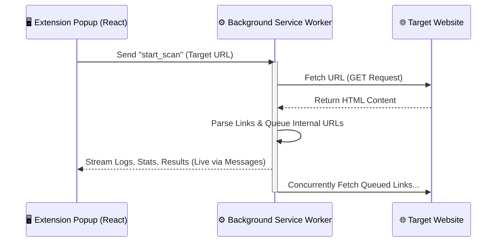
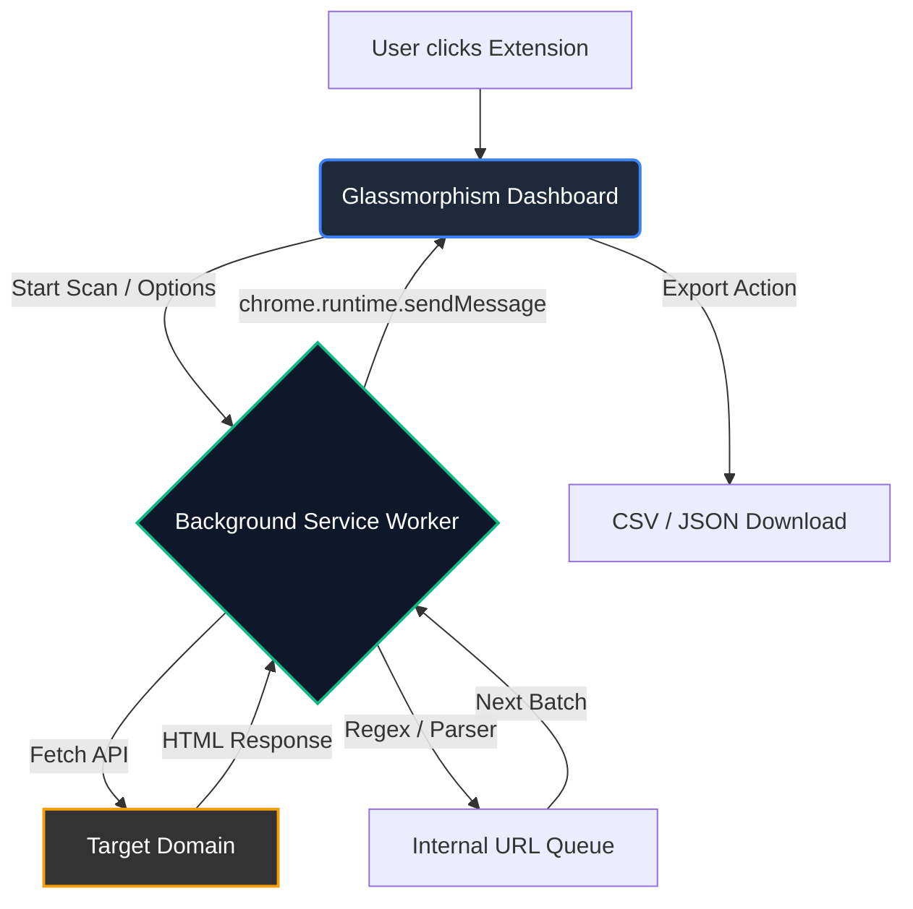

<div align="center">
  
  
  
  <h1 align="center">404 Error Scanner Chrome Extension</h1>
  <p align="center">
    <strong>A professional, high-performance web crawler and HTTP status analyzer built directly into your browser.</strong>
  </p>
  <p align="center">
    
    
    
  </p>
</div>

<br />


*(Illustration of web analysis & crawling)*

---

## 🚀 Features

- 🕵️‍♂️ **Standalone Chrome Extension:** No Node.js or backend servers required. It leverages Chrome's Manifest V3 Background Service Workers to bypass CORS and crawl efficiently.
- ⚡ **Real-Time Analysis:** View a live stream of crawling logs and statistics right inside the sleek extension popup.
- 🔄 **Concurrent Crawling:** Built-in asynchronous queue processing with adjustable thread/concurrency limits.
- 🎨 **Glassmorphism UI:** A beautiful, modern React interface built with pure CSS.
- 📊 **Data Export:** Export your scan results in `CSV` or `JSON` formats instantly.
- 🔍 **Smart Filters:** Filter results by Status Code (200, 301, 404, 500, etc.) and search by URL.
- ⚙️ **Advanced Configuration:** Set custom User-Agents, timeouts, delays, and exclude specific folders or `robots.txt`.

---

## 🏗️ Architecture & Work Flow

The extension relies on a powerful **Background Service Worker** to independently fetch pages and extract links without slowing down your browser or being blocked by Cross-Origin Resource Sharing (CORS) rules.

### Process Flow Diagram



### System Architecture



---

## 💻 Getting Started

### Prerequisites
- [Node.js](https://nodejs.org/) (v18 or higher recommended)
- `npm` or `yarn`

### Installation & Build

1. **Clone the repository:**
   ```bash
   git clone https://github.com/onder007/error-Scanner.git
   cd error-Scanner
   ```

2. **Install dependencies:**
   ```bash
   npm install
   ```

3. **Build the extension:**
   ```bash
   npm run build
   ```
   *This will generate a `dist` folder in the root directory containing the compiled extension.*

---

## 🔌 Loading into Chrome

1. Open Google Chrome and navigate to `chrome://extensions/`.
2. Enable **Developer mode** using the toggle switch in the top right corner.
3. Click the **Load unpacked** button in the top left corner.
4. Select the `dist` folder that was generated in the previous step.
5. **Done!** Click the puzzle icon in Chrome to pin the extension to your toolbar and start scanning.

---

## 🛠️ Tech Stack

- **UI Framework:** [React.js](https://reactjs.org/) + [Vite](https://vitejs.dev/)
- **Extension Infrastructure:** Chrome Manifest V3, Service Workers
- **HTML Parsing:** Cheerio (Browser version) & Regex Pattern Matching
- **Styling:** Vanilla CSS (Glassmorphism aesthetics)

---

## 📜 License

This project is licensed under the **MIT License**. Feel free to use, modify, and distribute this software.
