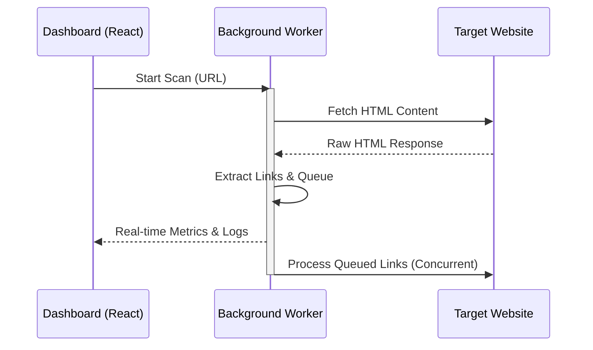
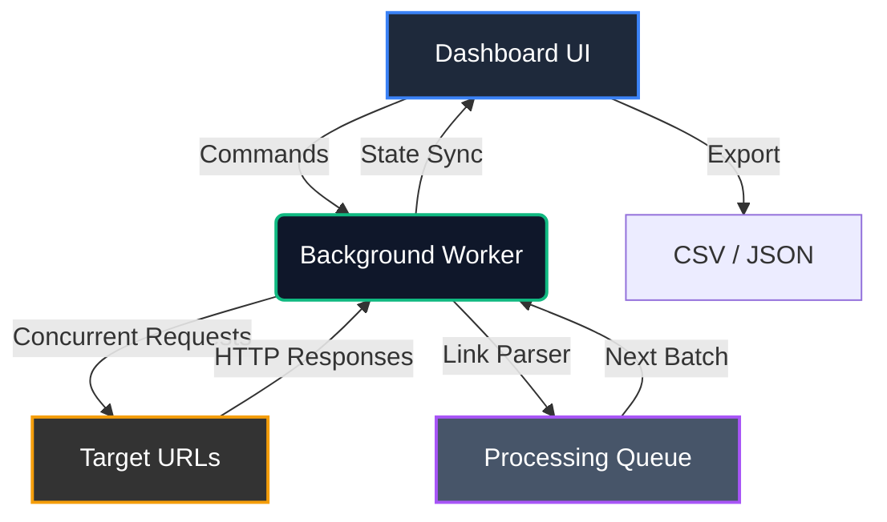

# Dead Links Scanner Chrome Extension

A high-performance Chrome Extension for crawling web pages and detecting broken links (404 errors) directly within the browser. Built with React, Vite, and Chrome Manifest V3.

## Technical Overview

The scanner leverages Chrome's **Manifest V3 Background Service Workers** to perform asynchronous, concurrent crawling. By operating within the background script, the extension bypasses standard web CORS restrictions, allowing it to fetch external URLs seamlessly.

### Core Technologies
- **Extension API:** Manifest V3
- **Frontend Framework:** React 18
- **Build Tool:** Vite + CRXJS Vite Plugin
- **HTML Parsing:** Cheerio (or Regex-based extraction)
- **State Management:** React Hooks with Chrome Runtime Messaging

## Architecture & Data Flow

### Process Flow
The extension uses a background service worker to fetch and process links concurrently, bypassing standard CORS limitations.



### System Components



1. **Popup Interface (`src/App.tsx`):**
   - Main control dashboard.
   - Sends `START_SCAN`, `PAUSE_SCAN`, and `RESUME_SCAN` messages to the Background Service Worker via `chrome.runtime.sendMessage`.
   - Listens to real-time progress updates (scanned URLs, broken links, queue size) via `chrome.runtime.onMessage`.

2. **Background Service Worker (`src/background.ts`):**
   - Maintains the crawling state and link queue in memory.
   - Implements a concurrent processing queue to limit simultaneous `fetch()` requests and prevent rate-limiting or memory exhaustion.
   - Parses fetched HTML content to extract `href` attributes, resolving relative paths against the base URL.
   - Checks the HTTP status codes of extracted links. URLs returning `404 Not Found` (or other 4xx/5xx codes) are flagged.

3. **Data Storage:**
   - Chrome's `chrome.storage.local` API can be used to persist scan results across extension restarts.

## Development & Build Instructions

### Prerequisites
- [Node.js](https://nodejs.org/) (v18+ recommended)
- `npm` or `yarn`

### Installation

1. Clone the repository and navigate to the project root:
   ```bash
   git clone https://github.com/onder007/dead-links-scanner.git
   cd dead-links-scanner
   ```

2. Install the required Node dependencies:
   ```bash
   npm install
   ```

### Running in Development Mode

To start the Vite development server with Hot Module Replacement (HMR) for the extension:
```bash
npm run dev
```

**Loading the unpacked extension in Chrome:**
1. Open Chrome and navigate to `chrome://extensions/`
2. Enable **Developer mode** in the top right corner.
3. Click **Load unpacked** and select the `dist` folder generated in your project root.
4. *Note: As you make changes to the React code, Vite/CRXJS will automatically update the unpacked extension.*

### Production Build

To build the extension for production deployment:
```bash
npm run build
```
The optimized, minified extension files will be output to the `dist` directory, ready to be zipped and uploaded to the Chrome Web Store.

## Extensibility

The scanning engine is modular and can be extended to support:
- Custom HTTP header injection (e.g., custom User-Agent).
- Respecting `robots.txt` and `<meta name="robots">` directives.
- Exporting raw scan datasets to JSON or CSV via Blob generation in the frontend.
